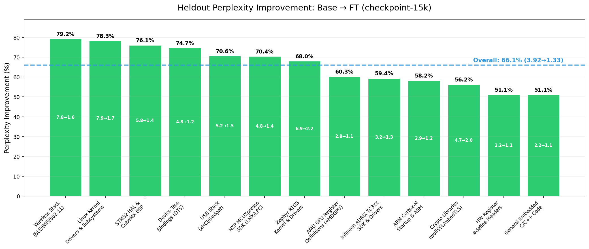
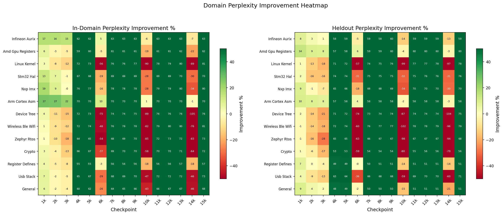
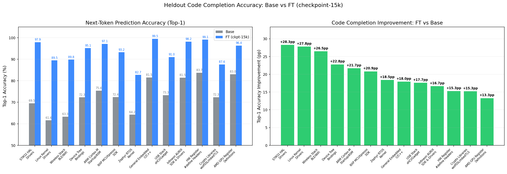
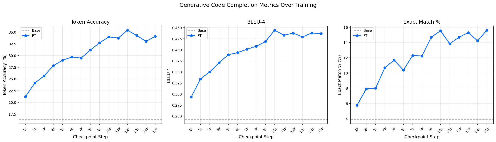
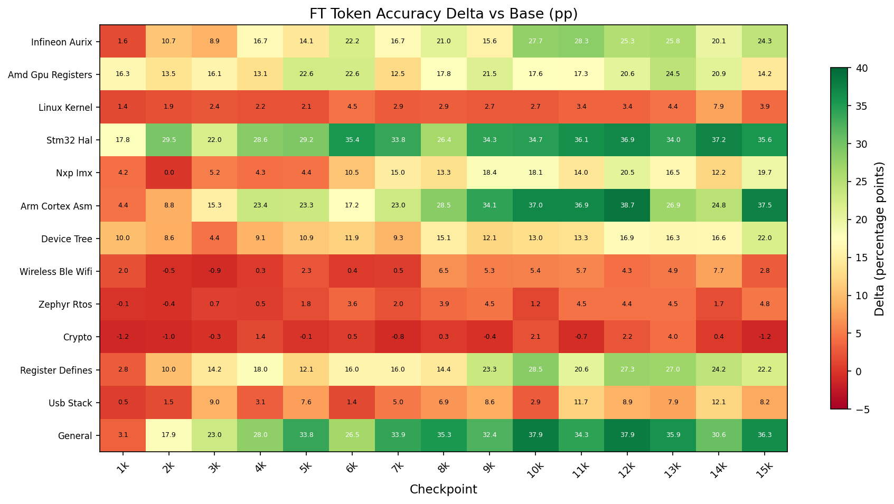
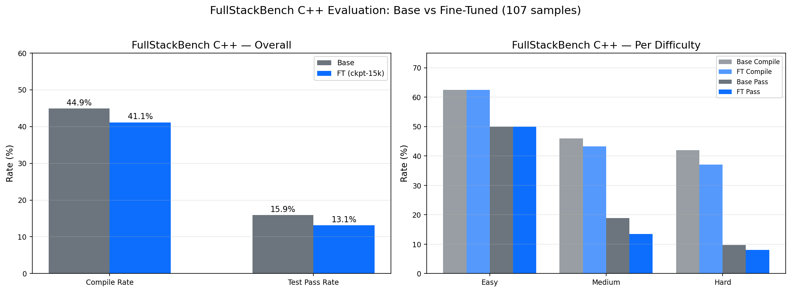
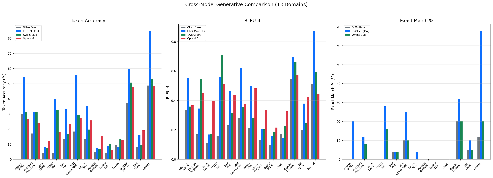
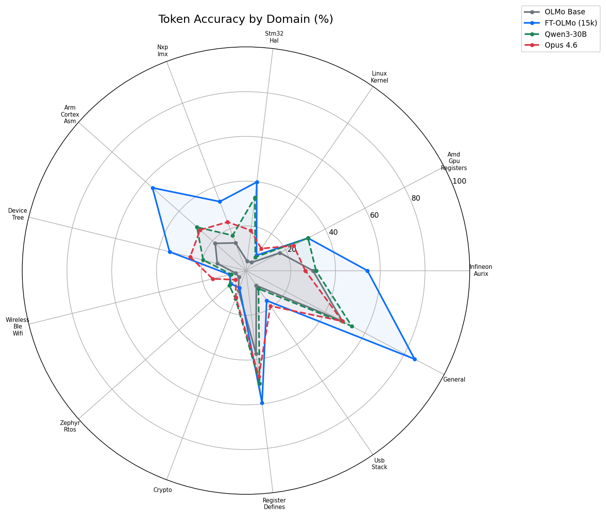
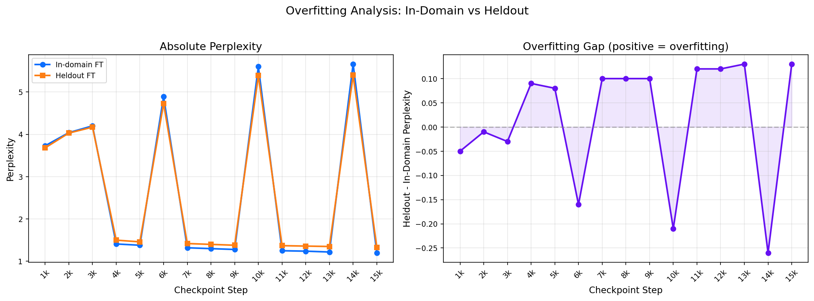

# CPT Evaluation Report: OLMo-7B on Embedded Systems Data

**Base Model:** allenai/OLMo-3-1025-7B
**Training:** BF16 LoRA, 8x H100, mix1_domain_only (~23.5B tokens)
**Checkpoints Evaluated:** 1k – 15k steps
**External Baselines:** Qwen3-Coder-30B, Claude Opus 4.6

---

## 1. Heldout Perplexity Improvement: Base vs FT (checkpoint-15k)



Percentage reduction in perplexity on **held-out** evaluation data (not seen during training). Each bar shows the improvement for a specific domain, with the base→FT perplexity values annotated. Domains are sourced from:

| Domain | Source Repos / Data |
|---|---|
| Infineon AURIX | AURIX TC3xx SDK, iLLD drivers, IfxGtm/IfxVadc/IfxDma APIs |
| AMD GPU Registers | AMDGPU kernel driver register definitions (DCN, SDMA, VCN, MMVM) |
| Linux Kernel | Kernel drivers, platform/PCI subsystems, net_device_ops |
| STM32 HAL | STM32Cube HAL/LL drivers, BSP configs, SystemClock_Config |
| NXP MCUXpresso | NXP MCUXpresso SDK, FSL drivers, LPC/i.MX board init |
| ARM Cortex ASM | Cortex-M startup files, NVIC/SCB handlers, vector tables |
| Device Tree | DTS/DTSI bindings, compatible strings, peripheral nodes |
| Wireless BLE/WiFi | ieee80211, nl80211, Bluetooth HCI, cfg80211 drivers |
| Zephyr RTOS | Zephyr kernel primitives (k_thread, k_sem, k_work), Kconfig |
| Crypto | wolfSSL, mbedTLS, AES/RSA implementations, crypto_alloc |
| Register Defines | Hardware register `#define` headers (MASK/SHIFT patterns) |
| USB Stack | USB gadget/device stack, xHCI/EHCI host drivers |
| General | Mixed embedded C/C++ code not matching specific domains |

<details>
<summary>Graph Data (JSON)</summary>

```json
{
  "description": "Heldout perplexity improvement (%), base vs checkpoint-15000",
  "overall_weighted": {
    "base": 3.92,
    "finetuned": 1.33
  },
  "per_domain": {
    "wireless_ble_wifi": {
      "base_ppl": 7.78,
      "ft_ppl": 1.62,
      "improvement_pct": 79.2
    },
    "linux_kernel": {
      "base_ppl": 7.93,
      "ft_ppl": 1.72,
      "improvement_pct": 78.3
    },
    "stm32_hal": {
      "base_ppl": 5.78,
      "ft_ppl": 1.38,
      "improvement_pct": 76.1
    },
    "device_tree": {
      "base_ppl": 4.83,
      "ft_ppl": 1.22,
      "improvement_pct": 74.7
    },
    "usb_stack": {
      "base_ppl": 5.17,
      "ft_ppl": 1.52,
      "improvement_pct": 70.6
    },
    "nxp_imx": {
      "base_ppl": 4.76,
      "ft_ppl": 1.41,
      "improvement_pct": 70.4
    },
    "zephyr_rtos": {
      "base_ppl": 6.94,
      "ft_ppl": 2.22,
      "improvement_pct": 68.0
    },
    "amd_gpu_registers": {
      "base_ppl": 2.82,
      "ft_ppl": 1.12,
      "improvement_pct": 60.3
    },
    "infineon_aurix": {
      "base_ppl": 3.18,
      "ft_ppl": 1.29,
      "improvement_pct": 59.4
    },
    "arm_cortex_asm": {
      "base_ppl": 2.85,
      "ft_ppl": 1.19,
      "improvement_pct": 58.2
    },
    "crypto": {
      "base_ppl": 4.66,
      "ft_ppl": 2.04,
      "improvement_pct": 56.2
    },
    "register_defines": {
      "base_ppl": 2.19,
      "ft_ppl": 1.07,
      "improvement_pct": 51.1
    },
    "general": {
      "base_ppl": 2.21,
      "ft_ppl": 1.08,
      "improvement_pct": 51.1
    }
  }
}
```
</details>
## 2. Domain Perplexity Improvement Heatmap



Green = improvement (lower perplexity), Red = regression. Each cell shows the % improvement for that domain at that checkpoint.

<details>
<summary>Graph Data (JSON)</summary>

```json
{
  "ppl_indomain": {
    "infineon_aurix": {
      "1000": 16.8,
      "2000": 16.5,
      "3000": 15.4,
      "4000": 62.4,
      "5000": 62.4,
      "6000": 4.7,
      "7000": 63.1,
      "8000": 63.1,
      "9000": 63.1,
      "10000": -6.1,
      "11000": 63.4,
      "12000": 63.4,
      "13000": 63.4,
      "14000": -6.8,
      "15000": 63.4
    },
    "amd_gpu_registers": {
      "1000": 6.5,
      "2000": -2.9,
      "3000": -4.7,
      "4000": 59.2,
      "5000": 59.9,
      "6000": -5.1,
      "7000": 60.6,
      "8000": 61.0,
      "9000": 61.0,
      "10000": -19.1,
      "11000": 61.4,
      "12000": 61.4,
      "13000": 61.7,
      "14000": -21.7,
      "15000": 62.1
    },
    "linux_kernel": {
      "1000": 2.6,
      "2000": -8.0,
      "3000": -12.2,
      "4000": 71.7,
      "5000": 73.2,
      "6000": -56.0,
      "7000": 75.5,
      "8000": 76.2,
      "9000": 77.0,
      "10000": -90.3,
      "11000": 78.5,
      "12000": 79.3,
      "13000": 80.1,
      "14000": -89.4,
      "15000": 80.9
    },
    "stm32_hal": {
      "1000": 12.9,
      "2000": 6.7,
      "3000": -0.8,
      "4000": 67.3,
      "5000": 67.6,
      "6000": -19.3,
      "7000": 68.6,
      "8000": 69.2,
      "9000": 69.2,
      "10000": -27.9,
      "11000": 69.4,
      "12000": 69.4,
      "13000": 69.7,
      "14000": -29.8,
      "15000": 69.7
    },
    "nxp_imx": {
      "1000": 19.3,
      "2000": 8.8,
      "3000": -0.5,
      "4000": 76.5,
      "5000": 77.2,
      "6000": -15.5,
      "7000": 78.0,
      "8000": 78.3,
      "9000": 78.5,
      "10000": -28.5,
      "11000": 79.0,
      "12000": 79.3,
      "13000": 79.7,
      "14000": -33.7,
      "15000": 79.7
    },
    "arm_cortex_asm": {
      "1000": 27.1,
      "2000": 26.8,
      "3000": 21.9,
      "4000": 69.5,
      "5000": 69.5,
      "6000": 10.5,
      "7000": 69.8,
      "8000": 70.1,
      "9000": 70.1,
      "10000": 1.1,
      "11000": 70.1,
      "12000": 70.1,
      "13000": 70.1,
      "14000": -1.1,
      "15000": 70.4
    },
    "device_tree": {
      "1000": 4.0,
      "2000": -10.6,
      "3000": -15.4,
      "4000": 71.8,
      "5000": 72.7,
      "6000": -74.7,
      "7000": 74.1,
      "8000": 74.5,
      "9000": 74.9,
      "10000": -89.1,
      "11000": 75.6,
      "12000": 75.6,
      "13000": 76.0,
      "14000": -105.0,
      "15000": 76.2
    },
    "wireless_ble_wifi": {
      "1000": 1.3,
      "2000": -9.0,
      "3000": -12.2,
      "4000": 72.0,
      "5000": 74.2,
      "6000": -48.0,
      "7000": 76.4,
      "8000": 77.5,
      "9000": 77.9,
      "10000": -82.0,
      "11000": 78.9,
      "12000": 79.6,
      "13000": 80.1,
      "14000": -76.1,
      "15000": 81.0
    },
    "zephyr_rtos": {
      "1000": 0.7,
      "2000": -9.7,
      "3000": -18.0,
      "4000": 63.8,
      "5000": 65.1,
      "6000": -53.5,
      "7000": 68.3,
      "8000": 69.2,
      "9000": 69.9,
      "10000": -84.8,
      "11000": 72.2,
      "12000": 72.6,
      "13000": 72.4,
      "14000": -83.0,
      "15000": 73.1
    },
    "crypto": {
      "1000": 3.3,
      "2000": -4.2,
      "3000": -13.2,
      "4000": 66.3,
      "5000": 67.2,
      "6000": -37.4,
      "7000": 69.2,
      "8000": 69.5,
      "9000": 69.9,
      "10000": -57.5,
      "11000": 70.3,
      "12000": 70.5,
      "13000": 70.9,
      "14000": -64.2,
      "15000": 71.5
    },
    "register_defines": {
      "1000": 4.5,
      "2000": -5.0,
      "3000": -8.3,
      "4000": 55.0,
      "5000": 55.4,
      "6000": -2.9,
      "7000": 55.8,
      "8000": 55.8,
      "9000": 55.8,
      "10000": -18.2,
      "11000": 56.2,
      "12000": 56.2,
      "13000": 56.6,
      "14000": -17.8,
      "15000": 56.6
    },
    "usb_stack": {
      "1000": 6.7,
      "2000": -2.1,
      "3000": -4.6,
      "4000": 65.2,
      "5000": 66.7,
      "6000": -29.0,
      "7000": 68.5,
      "8000": 69.4,
      "9000": 70.2,
      "10000": -47.1,
      "11000": 71.7,
      "12000": 71.9,
      "13000": 72.5,
      "14000": -46.5,
      "15000": 73.1
    },
    "general": {
      "1000": 6.2,
      "2000": -2.1,
      "3000": -4.5,
      "4000": 60.4,
      "5000": 61.6,
      "6000": -25.6,
      "7000": 64.2,
      "8000": 65.4,
      "9000": 65.6,
      "10000": -42.7,
      "11000": 66.4,
      "12000": 66.8,
      "13000": 67.3,
      "14000": -46.2,
      "15000": 68.0
    }
  },
  "ppl_heldout": {
    "infineon_aurix": {
      "1000": 8.2,
      "2000": 3.1,
      "3000": 0.6,
      "4000": 57.5,
      "5000": 59.4,
      "6000": -4.7,
      "7000": 58.8,
      "8000": 58.5,
      "9000": 59.7,
      "10000": -13.5,
      "11000": 59.1,
      "12000": 58.8,
      "13000": 58.8,
      "14000": -13.2,
      "15000": 59.4
    },
    "amd_gpu_registers": {
      "1000": 13.8,
      "2000": 8.9,
      "3000": 8.5,
      "4000": 57.4,
      "5000": 58.5,
      "6000": 6.0,
      "7000": 58.9,
      "8000": 59.2,
      "9000": 59.6,
      "10000": -3.5,
      "11000": 59.6,
      "12000": 59.9,
      "13000": 59.9,
      "14000": -3.2,
      "15000": 60.3
    },
    "linux_kernel": {
      "1000": 0.9,
      "2000": -13.1,
      "3000": -18.2,
      "4000": 70.9,
      "5000": 72.0,
      "6000": -56.6,
      "7000": 74.3,
      "8000": 74.9,
      "9000": 75.5,
      "10000": -99.1,
      "11000": 76.7,
      "12000": 77.2,
      "13000": 77.6,
      "14000": -97.1,
      "15000": 78.3
    },
    "stm32_hal": {
      "1000": 2.2,
      "2000": -15.6,
      "3000": -15.7,
      "4000": 73.7,
      "5000": 74.4,
      "6000": -31.1,
      "7000": 74.7,
      "8000": 75.1,
      "9000": 75.3,
      "10000": -32.0,
      "11000": 75.3,
      "12000": 75.8,
      "13000": 75.8,
      "14000": -31.3,
      "15000": 76.1
    },
    "nxp_imx": {
      "1000": 8.8,
      "2000": -1.1,
      "3000": -6.9,
      "4000": 65.1,
      "5000": 66.4,
      "6000": -18.5,
      "7000": 67.9,
      "8000": 68.5,
      "9000": 68.9,
      "10000": -33.6,
      "11000": 69.5,
      "12000": 69.5,
      "13000": 70.0,
      "14000": -30.3,
      "15000": 70.4
    },
    "arm_cortex_asm": {
      "1000": 9.8,
      "2000": 8.4,
      "3000": 7.7,
      "4000": 56.8,
      "5000": 57.9,
      "6000": 3.9,
      "7000": 57.5,
      "8000": 57.5,
      "9000": 58.2,
      "10000": -2.5,
      "11000": 58.2,
      "12000": 57.9,
      "13000": 57.9,
      "14000": -2.8,
      "15000": 58.2
    },
    "device_tree": {
      "1000": 1.9,
      "2000": -14.3,
      "3000": -21.3,
      "4000": 71.4,
      "5000": 72.3,
      "6000": -73.7,
      "7000": 73.3,
      "8000": 73.5,
      "9000": 73.7,
      "10000": -86.7,
      "11000": 74.3,
      "12000": 74.5,
      "13000": 74.5,
      "14000": -104.3,
      "15000": 74.7
    },
    "wireless_ble_wifi": {
      "1000": -1.3,
      "2000": -14.0,
      "3000": -18.5,
      "4000": 72.4,
      "5000": 73.5,
      "6000": -60.0,
      "7000": 75.8,
      "8000": 76.9,
      "9000": 77.1,
      "10000": -102.1,
      "11000": 77.8,
      "12000": 78.3,
      "13000": 78.7,
      "14000": -95.5,
      "15000": 79.2
    },
    "zephyr_rtos": {
      "1000": -1.0,
      "2000": -16.3,
      "3000": -28.4,
      "4000": 64.8,
      "5000": 65.3,
      "6000": -62.8,
      "7000": 66.0,
      "8000": 66.7,
      "9000": 66.9,
      "10000": -98.1,
      "11000": 67.3,
      "12000": 67.3,
      "13000": 67.4,
      "14000": -93.8,
      "15000": 68.0
    },
    "crypto": {
      "1000": 1.1,
      "2000": -6.2,
      "3000": -17.2,
      "4000": 52.6,
      "5000": 52.8,
      "6000": -59.4,
      "7000": 53.6,
      "8000": 54.1,
      "9000": 54.3,
      "10000": -80.3,
      "11000": 55.2,
      "12000": 55.6,
      "13000": 55.6,
      "14000": -79.2,
      "15000": 56.2
    },
    "register_defines": {
      "1000": 7.3,
      "2000": 0.5,
      "3000": -3.7,
      "4000": 48.9,
      "5000": 49.3,
      "6000": -0.5,
      "7000": 50.2,
      "8000": 50.7,
      "9000": 50.7,
      "10000": -14.2,
      "11000": 50.7,
      "12000": 50.7,
      "13000": 51.1,
      "14000": -14.2,
      "15000": 51.1
    },
    "usb_stack": {
      "1000": 3.7,
      "2000": -8.7,
      "3000": -13.3,
      "4000": 62.7,
      "5000": 64.2,
      "6000": -36.2,
      "7000": 66.0,
      "8000": 67.5,
      "9000": 68.1,
      "10000": -58.8,
      "11000": 69.2,
      "12000": 69.8,
      "13000": 70.2,
      "14000": -59.8,
      "15000": 70.6
    },
    "general": {
      "1000": 9.0,
      "2000": 4.1,
      "3000": 1.8,
      "4000": 48.4,
      "5000": 48.9,
      "6000": -1.8,
      "7000": 49.8,
      "8000": 50.2,
      "9000": 50.2,
      "10000": -15.4,
      "11000": 50.7,
      "12000": 50.7,
      "13000": 50.7,
      "14000": -20.8,
      "15000": 51.1
    }
  }
}
```
</details>
## 3. Heldout Code Completion Accuracy: Base vs FT (checkpoint-15k)



Next-token prediction accuracy on held-out code. Left: absolute Top-1 accuracy per domain. Right: improvement in percentage points.

<details>
<summary>Graph Data (JSON)</summary>

```json
{
  "description": "Heldout code completion (suffix prediction), base vs checkpoint-15000",
  "per_domain": {
    "stm32_hal": {
      "base_top1": 69.55,
      "ft_top1": 97.89,
      "improvement_pp": 28.34,
      "base_top5": 85.97,
      "ft_top5": 99.67,
      "n_samples": 50
    },
    "linux_kernel": {
      "base_top1": 61.63,
      "ft_top1": 89.47,
      "improvement_pp": 27.84,
      "base_top5": 81.06,
      "ft_top5": 97.59,
      "n_samples": 100
    },
    "wireless_ble_wifi": {
      "base_top1": 63.31,
      "ft_top1": 89.83,
      "improvement_pp": 26.52,
      "base_top5": 81.44,
      "ft_top5": 97.47,
      "n_samples": 50
    },
    "device_tree": {
      "base_top1": 72.31,
      "ft_top1": 95.14,
      "improvement_pp": 22.83,
      "base_top5": 86.11,
      "ft_top5": 98.76,
      "n_samples": 50
    },
    "arm_cortex_asm": {
      "base_top1": 75.4,
      "ft_top1": 97.13,
      "improvement_pp": 21.73,
      "base_top5": 86.92,
      "ft_top5": 99.47,
      "n_samples": 30
    },
    "nxp_imx": {
      "base_top1": 72.38,
      "ft_top1": 93.24,
      "improvement_pp": 20.86,
      "base_top5": 86.47,
      "ft_top5": 98.12,
      "n_samples": 50
    },
    "zephyr_rtos": {
      "base_top1": 64.25,
      "ft_top1": 82.71,
      "improvement_pp": 18.46,
      "base_top5": 82.94,
      "ft_top5": 94.52,
      "n_samples": 30
    },
    "general": {
      "base_top1": 81.53,
      "ft_top1": 99.49,
      "improvement_pp": 17.96,
      "base_top5": 89.7,
      "ft_top5": 99.9,
      "n_samples": 50
    },
    "usb_stack": {
      "base_top1": 73.31,
      "ft_top1": 90.98,
      "improvement_pp": 17.67,
      "base_top5": 87.34,
      "ft_top5": 97.54,
      "n_samples": 30
    },
    "infineon_aurix": {
      "base_top1": 81.45,
      "ft_top1": 98.16,
      "improvement_pp": 16.71,
      "base_top5": 90.92,
      "ft_top5": 99.35,
      "n_samples": 100
    },
    "register_defines": {
      "base_top1": 83.74,
      "ft_top1": 99.07,
      "improvement_pp": 15.33,
      "base_top5": 93.35,
      "ft_top5": 99.87,
      "n_samples": 100
    },
    "crypto": {
      "base_top1": 72.32,
      "ft_top1": 87.58,
      "improvement_pp": 15.26,
      "base_top5": 88.13,
      "ft_top5": 96.22,
      "n_samples": 30
    },
    "amd_gpu_registers": {
      "base_top1": 83.03,
      "ft_top1": 96.35,
      "improvement_pp": 13.32,
      "base_top5": 91.86,
      "ft_top5": 99.85,
      "n_samples": 100
    }
  }
}
```
</details>
## 4. Generative Metrics Over Training



Average token accuracy, BLEU-4, and exact match percentage across all 13 domains at each checkpoint.

<details>
<summary>Graph Data (JSON)</summary>

```json
{
  "token_accuracy": {
    "checkpoints": [
      1000,
      2000,
      3000,
      4000,
      5000,
      6000,
      7000,
      8000,
      9000,
      10000,
      11000,
      12000,
      13000,
      14000,
      15000
    ],
    "base": [
      0.164,
      0.164,
      0.164,
      0.164,
      0.164,
      0.164,
      0.164,
      0.164,
      0.164,
      0.164,
      0.164,
      0.164,
      0.164,
      0.164,
      0.164
    ],
    "ft": [
      0.2123,
      0.2413,
      0.2564,
      0.2784,
      0.2901,
      0.297,
      0.2947,
      0.3119,
      0.3274,
      0.3399,
      0.3374,
      0.3542,
      0.3429,
      0.3305,
      0.3411
    ]
  },
  "bleu4": {
    "checkpoints": [
      1000,
      2000,
      3000,
      4000,
      5000,
      6000,
      7000,
      8000,
      9000,
      10000,
      11000,
      12000,
      13000,
      14000,
      15000
    ],
    "base": [
      0.2428,
      0.2428,
      0.2428,
      0.2428,
      0.2428,
      0.2428,
      0.2428,
      0.2428,
      0.2428,
      0.2428,
      0.2428,
      0.2428,
      0.2428,
      0.2428,
      0.2428
    ],
    "ft": [
      0.2933,
      0.3343,
      0.35,
      0.371,
      0.3889,
      0.3936,
      0.4014,
      0.4079,
      0.4187,
      0.4443,
      0.4332,
      0.4378,
      0.4293,
      0.4381,
      0.4367
    ]
  },
  "exact_match_pct": {
    "checkpoints": [
      1000,
      2000,
      3000,
      4000,
      5000,
      6000,
      7000,
      8000,
      9000,
      10000,
      11000,
      12000,
      13000,
      14000,
      15000
    ],
    "base": [
      0.0392,
      0.0392,
      0.0392,
      0.0392,
      0.0392,
      0.0392,
      0.0392,
      0.0392,
      0.0392,
      0.0392,
      0.0392,
      0.0392,
      0.0392,
      0.0392,
      0.0392
    ],
    "ft": [
      0.0577,
      0.0792,
      0.08,
      0.1069,
      0.1169,
      0.1038,
      0.1231,
      0.1223,
      0.1469,
      0.1554,
      0.1385,
      0.1469,
      0.1531,
      0.1423,
      0.1562
    ]
  }
}
```
</details>
## 5. Generative Token Accuracy Delta Heatmap



Each cell shows the token accuracy improvement (in percentage points) of the finetuned model over the base model for each domain at each checkpoint.

<details>
<summary>Graph Data (JSON)</summary>

```json
{
  "infineon_aurix": {
    "1000": 1.64,
    "2000": 10.66,
    "3000": 8.94,
    "4000": 16.71,
    "5000": 14.06,
    "6000": 22.2,
    "7000": 16.7,
    "8000": 20.97,
    "9000": 15.65,
    "10000": 27.74,
    "11000": 28.27,
    "12000": 25.29,
    "13000": 25.81,
    "14000": 20.08,
    "15000": 24.35
  },
  "amd_gpu_registers": {
    "1000": 16.3,
    "2000": 13.49,
    "3000": 16.07,
    "4000": 13.13,
    "5000": 22.64,
    "6000": 22.58,
    "7000": 12.54,
    "8000": 17.82,
    "9000": 21.48,
    "10000": 17.57,
    "11000": 17.32,
    "12000": 20.56,
    "13000": 24.49,
    "14000": 20.94,
    "15000": 14.19
  },
  "linux_kernel": {
    "1000": 1.37,
    "2000": 1.93,
    "3000": 2.39,
    "4000": 2.21,
    "5000": 2.09,
    "6000": 4.49,
    "7000": 2.87,
    "8000": 2.94,
    "9000": 2.73,
    "10000": 2.67,
    "11000": 3.35,
    "12000": 3.37,
    "13000": 4.38,
    "14000": 7.91,
    "15000": 3.89
  },
  "stm32_hal": {
    "1000": 17.82,
    "2000": 29.52,
    "3000": 21.98,
    "4000": 28.61,
    "5000": 29.16,
    "6000": 35.45,
    "7000": 33.82,
    "8000": 26.37,
    "9000": 34.27,
    "10000": 34.7,
    "11000": 36.09,
    "12000": 36.94,
    "13000": 34.03,
    "14000": 37.21,
    "15000": 35.6
  },
  "nxp_imx": {
    "1000": 4.18,
    "2000": 0.05,
    "3000": 5.24,
    "4000": 4.26,
    "5000": 4.35,
    "6000": 10.55,
    "7000": 15.03,
    "8000": 13.26,
    "9000": 18.35,
    "10000": 18.06,
    "11000": 14.03,
    "12000": 20.51,
    "13000": 16.48,
    "14000": 12.21,
    "15000": 19.74
  },
  "arm_cortex_asm": {
    "1000": 4.38,
    "2000": 8.82,
    "3000": 15.33,
    "4000": 23.4,
    "5000": 23.3,
    "6000": 17.22,
    "7000": 22.97,
    "8000": 28.5,
    "9000": 34.13,
    "10000": 36.99,
    "11000": 36.9,
    "12000": 38.7,
    "13000": 26.86,
    "14000": 24.82,
    "15000": 37.45
  },
  "device_tree": {
    "1000": 10.04,
    "2000": 8.56,
    "3000": 4.45,
    "4000": 9.06,
    "5000": 10.9,
    "6000": 11.86,
    "7000": 9.28,
    "8000": 15.11,
    "9000": 12.08,
    "10000": 12.98,
    "11000": 13.33,
    "12000": 16.85,
    "13000": 16.29,
    "14000": 16.59,
    "15000": 21.97
  },
  "wireless_ble_wifi": {
    "1000": 2.0,
    "2000": -0.55,
    "3000": -0.93,
    "4000": 0.34,
    "5000": 2.27,
    "6000": 0.39,
    "7000": 0.53,
    "8000": 6.55,
    "9000": 5.28,
    "10000": 5.43,
    "11000": 5.74,
    "12000": 4.29,
    "13000": 4.92,
    "14000": 7.66,
    "15000": 2.76
  },
  "zephyr_rtos": {
    "1000": -0.12,
    "2000": -0.4,
    "3000": 0.71,
    "4000": 0.45,
    "5000": 1.75,
    "6000": 3.64,
    "7000": 2.03,
    "8000": 3.9,
    "9000": 4.5,
    "10000": 1.16,
    "11000": 4.46,
    "12000": 4.4,
    "13000": 4.47,
    "14000": 1.7,
    "15000": 4.79
  },
  "crypto": {
    "1000": -1.19,
    "2000": -1.02,
    "3000": -0.31,
    "4000": 1.42,
    "5000": -0.11,
    "6000": 0.54,
    "7000": -0.8,
    "8000": 0.3,
    "9000": -0.41,
    "10000": 2.07,
    "11000": -0.73,
    "12000": 2.21,
    "13000": 4.01,
    "14000": 0.38,
    "15000": -1.25
  },
  "register_defines": {
    "1000": 2.76,
    "2000": 10.03,
    "3000": 14.22,
    "4000": 17.98,
    "5000": 12.08,
    "6000": 15.97,
    "7000": 16.0,
    "8000": 14.41,
    "9000": 23.33,
    "10000": 28.46,
    "11000": 20.59,
    "12000": 27.27,
    "13000": 26.97,
    "14000": 24.21,
    "15000": 22.17
  },
  "usb_stack": {
    "1000": 0.46,
    "2000": 1.53,
    "3000": 8.99,
    "4000": 3.08,
    "5000": 7.64,
    "6000": 1.45,
    "7000": 4.96,
    "8000": 6.89,
    "9000": 8.65,
    "10000": 2.9,
    "11000": 11.7,
    "12000": 8.92,
    "13000": 7.92,
    "14000": 12.06,
    "15000": 8.19
  },
  "general": {
    "1000": 3.11,
    "2000": 17.89,
    "3000": 23.01,
    "4000": 28.04,
    "5000": 33.79,
    "6000": 26.55,
    "7000": 33.93,
    "8000": 35.28,
    "9000": 32.43,
    "10000": 37.95,
    "11000": 34.32,
    "12000": 37.9,
    "13000": 35.93,
    "14000": 30.61,
    "15000": 36.34
  }
}
```
</details>
## 6. FullStackBench C++ Evaluation



General C++ programming benchmark (ByteDance/FullStackBench, 107 C++ samples). Tests whether CPT on embedded data affects general-purpose coding ability.

| Metric | Base | FT (ckpt-15k) | Delta |
|---|---|---|---|
| Compile Rate | 44.9% | 41.1% | -3.8% |
| Test Pass Rate | 15.9% | 13.1% | -2.8% |

| Difficulty | Base Compile | FT Compile | Base Pass | FT Pass |
|---|---|---|---|---|
| Easy (8) | 62.5% | 62.5% | 50.0% | 50.0% |
| Medium (37) | 45.9% | 43.2% | 18.9% | 13.5% |
| Hard (62) | 41.9% | 37.1% | 9.7% | 8.1% |

<details>
<summary>Graph Data (JSON)</summary>

```json
{
  "n_samples": 107,
  "base": {
    "compile_rate": 44.9,
    "pass_rate": 15.9,
    "by_difficulty": {
      "hard": {
        "total": 62,
        "compile_ok": 26,
        "run_ok": 6,
        "compile_rate": 41.9,
        "pass_rate": 9.7
      },
      "medium": {
        "total": 37,
        "compile_ok": 17,
        "run_ok": 7,
        "compile_rate": 45.9,
        "pass_rate": 18.9
      },
      "easy": {
        "total": 8,
        "compile_ok": 5,
        "run_ok": 4,
        "compile_rate": 62.5,
        "pass_rate": 50.0
      }
    }
  },
  "ft": {
    "compile_rate": 41.1,
    "pass_rate": 13.1,
    "by_difficulty": {
      "easy": {
        "total": 8,
        "compile_ok": 5,
        "run_ok": 4,
        "compile_rate": 62.5,
        "pass_rate": 50.0
      },
      "medium": {
        "total": 37,
        "compile_ok": 16,
        "run_ok": 5,
        "compile_rate": 43.2,
        "pass_rate": 13.5
      },
      "hard": {
        "total": 62,
        "compile_ok": 23,
        "run_ok": 5,
        "compile_rate": 37.1,
        "pass_rate": 8.1
      }
    }
  }
}
```
</details>
## 7. Cross-Model Generative Comparison



Comparison of generative code completion across OLMo Base, FT-OLMo (checkpoint-15k), Qwen3-Coder-30B, and Claude Opus 4.6 on all 13 embedded systems domains.

<details>
<summary>Graph Data (JSON)</summary>

```json
{
  "token_accuracy": {
    "domains": [
      "infineon_aurix",
      "amd_gpu_registers",
      "linux_kernel",
      "stm32_hal",
      "nxp_imx",
      "arm_cortex_asm",
      "device_tree",
      "wireless_ble_wifi",
      "zephyr_rtos",
      "crypto",
      "register_defines",
      "usb_stack",
      "general"
    ],
    "base": [
      0.2992,
      0.1712,
      0.0443,
      0.0425,
      0.1325,
      0.1836,
      0.1322,
      0.0475,
      0.042,
      0.0944,
      0.3743,
      0.0811,
      0.4873
    ],
    "ft_15k": [
      0.5427,
      0.3131,
      0.0832,
      0.3985,
      0.3299,
      0.5581,
      0.3519,
      0.0751,
      0.0898,
      0.082,
      0.5961,
      0.163,
      0.8507
    ],
    "qwen3_30b": [
      0.3129,
      0.3132,
      0.0734,
      0.3282,
      0.1683,
      0.2928,
      0.197,
      0.0682,
      0.0997,
      0.1334,
      0.5075,
      0.098,
      0.5339
    ],
    "opus_4_6": [
      0.2651,
      0.2403,
      0.1199,
      0.1813,
      0.2323,
      0.2741,
      0.2571,
      0.1534,
      0.0614,
      0.1279,
      0.4768,
      0.1922,
      0.487
    ]
  },
  "bleu4": {
    "domains": [
      "infineon_aurix",
      "amd_gpu_registers",
      "linux_kernel",
      "stm32_hal",
      "nxp_imx",
      "arm_cortex_asm",
      "device_tree",
      "wireless_ble_wifi",
      "zephyr_rtos",
      "crypto",
      "register_defines",
      "usb_stack",
      "general"
    ],
    "base": [
      0.3356,
      0.1706,
      0.1116,
      0.1579,
      0.2312,
      0.2805,
      0.2123,
      0.1322,
      0.0957,
      0.1735,
      0.5449,
      0.1997,
      0.5113
    ],
    "ft_15k": [
      0.5498,
      0.3451,
      0.1693,
      0.5625,
      0.4653,
      0.6205,
      0.4987,
      0.2065,
      0.1604,
      0.1479,
      0.697,
      0.3791,
      0.8751
    ],
    "qwen3_30b": [
      0.3595,
      0.5462,
      0.1724,
      0.7066,
      0.3177,
      0.3573,
      0.28,
      0.2038,
      0.1886,
      0.2288,
      0.6634,
      0.2445,
      0.594
    ],
    "opus_4_6": [
      0.3667,
      0.449,
      0.3957,
      0.5141,
      0.4356,
      0.3775,
      0.4831,
      0.3373,
      0.216,
      0.326,
      0.573,
      0.4218,
      0.4453
    ]
  },
  "exact_match_pct": {
    "domains": [
      "infineon_aurix",
      "amd_gpu_registers",
      "linux_kernel",
      "stm32_hal",
      "nxp_imx",
      "arm_cortex_asm",
      "device_tree",
      "wireless_ble_wifi",
      "zephyr_rtos",
      "crypto",
      "register_defines",
      "usb_stack",
      "general"
    ],
    "base": [
      0.0,
      0.0,
      0.0,
      0.0,
      0.04,
      0.1,
      0.0,
      0.0,
      0.0,
      0.0,
      0.2,
      0.05,
      0.12
    ],
    "ft_15k": [
      0.2,
      0.12,
      0.0,
      0.28,
      0.04,
      0.25,
      0.04,
      0.0,
      0.0,
      0.0,
      0.32,
      0.1,
      0.68
    ],
    "qwen3_30b": [
      0.0,
      0.08,
      0.0,
      0.16,
      0.04,
      0.1,
      0.0,
      0.0,
      0.0,
      0.0,
      0.2,
      0.05,
      0.2
    ],
    "opus_4_6": [
      0.0,
      0.0,
      0.0,
      0.0,
      0.0,
      0.0,
      0.0,
      0.0,
      0.0,
      0.0,
      0.0,
      0.0,
      0.0
    ]
  }
}
```
</details>
## 8. Domain Coverage Radar Chart



Spider/radar chart showing token accuracy across all 13 embedded systems domains for each model. Larger area = better domain coverage.

<details>
<summary>Graph Data (JSON)</summary>

```json
{
  "domains": [
    "infineon_aurix",
    "amd_gpu_registers",
    "linux_kernel",
    "stm32_hal",
    "nxp_imx",
    "arm_cortex_asm",
    "device_tree",
    "wireless_ble_wifi",
    "zephyr_rtos",
    "crypto",
    "register_defines",
    "usb_stack",
    "general"
  ],
  "base": [
    29.92,
    17.12,
    4.43,
    4.25,
    13.25,
    18.36,
    13.22,
    4.75,
    4.2,
    9.44,
    37.43,
    8.11,
    48.73
  ],
  "ft_15k": [
    54.27,
    31.31,
    8.32,
    39.85,
    32.99,
    55.81,
    35.19,
    7.51,
    8.98,
    8.2,
    59.61,
    16.3,
    85.07
  ],
  "qwen3_30b": [
    31.29,
    31.32,
    7.34,
    32.82,
    16.83,
    29.28,
    19.7,
    6.82,
    9.97,
    13.34,
    50.75,
    9.8,
    53.39
  ],
  "opus_4_6": [
    26.51,
    24.03,
    11.99,
    18.13,
    23.23,
    27.41,
    25.71,
    15.34,
    6.14,
    12.79,
    47.68,
    19.22,
    48.7
  ]
}
```
</details>
## 9. Overfitting Analysis



Left: absolute FT perplexity on in-domain vs heldout data. Right: the gap between them (positive = overfitting, the model fits training data better than held-out data).

<details>
<summary>Graph Data (JSON)</summary>

```json
{
  "checkpoints": [
    1000,
    2000,
    3000,
    4000,
    5000,
    6000,
    7000,
    8000,
    9000,
    10000,
    11000,
    12000,
    13000,
    14000,
    15000
  ],
  "indomain_ft_ppl": [
    3.73,
    4.04,
    4.2,
    1.41,
    1.38,
    4.89,
    1.32,
    1.3,
    1.28,
    5.6,
    1.25,
    1.24,
    1.22,
    5.66,
    1.2
  ],
  "heldout_ft_ppl": [
    3.68,
    4.03,
    4.17,
    1.5,
    1.46,
    4.73,
    1.42,
    1.4,
    1.38,
    5.39,
    1.37,
    1.36,
    1.35,
    5.4,
    1.33
  ],
  "gap": [
    -0.05,
    -0.01,
    -0.03,
    0.09,
    0.08,
    -0.16,
    0.1,
    0.1,
    0.1,
    -0.21,
    0.12,
    0.12,
    0.13,
    -0.26,
    0.13
  ]
}
```
</details>


---

## All Graph Data (Combined JSON)

<details>
<summary>Click to expand full JSON</summary>

```json
{
  "perplexity_improvement": {
    "description": "Heldout perplexity improvement (%), base vs checkpoint-15000",
    "overall_weighted": {
      "base": 3.92,
      "finetuned": 1.33
    },
    "per_domain": {
      "wireless_ble_wifi": {
        "base_ppl": 7.78,
        "ft_ppl": 1.62,
        "improvement_pct": 79.2
      },
      "linux_kernel": {
        "base_ppl": 7.93,
        "ft_ppl": 1.72,
        "improvement_pct": 78.3
      },
      "stm32_hal": {
        "base_ppl": 5.78,
        "ft_ppl": 1.38,
        "improvement_pct": 76.1
      },
      "device_tree": {
        "base_ppl": 4.83,
        "ft_ppl": 1.22,
        "improvement_pct": 74.7
      },
      "usb_stack": {
        "base_ppl": 5.17,
        "ft_ppl": 1.52,
        "improvement_pct": 70.6
      },
      "nxp_imx": {
        "base_ppl": 4.76,
        "ft_ppl": 1.41,
        "improvement_pct": 70.4
      },
      "zephyr_rtos": {
        "base_ppl": 6.94,
        "ft_ppl": 2.22,
        "improvement_pct": 68.0
      },
      "amd_gpu_registers": {
        "base_ppl": 2.82,
        "ft_ppl": 1.12,
        "improvement_pct": 60.3
      },
      "infineon_aurix": {
        "base_ppl": 3.18,
        "ft_ppl": 1.29,
        "improvement_pct": 59.4
      },
      "arm_cortex_asm": {
        "base_ppl": 2.85,
        "ft_ppl": 1.19,
        "improvement_pct": 58.2
      },
      "crypto": {
        "base_ppl": 4.66,
        "ft_ppl": 2.04,
        "improvement_pct": 56.2
      },
      "register_defines": {
        "base_ppl": 2.19,
        "ft_ppl": 1.07,
        "improvement_pct": 51.1
      },
      "general": {
        "base_ppl": 2.21,
        "ft_ppl": 1.08,
        "improvement_pct": 51.1
      }
    }
  },
  "perplexity_heatmap": {
    "ppl_indomain": {
      "infineon_aurix": {
        "1000": 16.8,
        "2000": 16.5,
        "3000": 15.4,
        "4000": 62.4,
        "5000": 62.4,
        "6000": 4.7,
        "7000": 63.1,
        "8000": 63.1,
        "9000": 63.1,
        "10000": -6.1,
        "11000": 63.4,
        "12000": 63.4,
        "13000": 63.4,
        "14000": -6.8,
        "15000": 63.4
      },
      "amd_gpu_registers": {
        "1000": 6.5,
        "2000": -2.9,
        "3000": -4.7,
        "4000": 59.2,
        "5000": 59.9,
        "6000": -5.1,
        "7000": 60.6,
        "8000": 61.0,
        "9000": 61.0,
        "10000": -19.1,
        "11000": 61.4,
        "12000": 61.4,
        "13000": 61.7,
        "14000": -21.7,
        "15000": 62.1
      },
      "linux_kernel": {
        "1000": 2.6,
        "2000": -8.0,
        "3000": -12.2,
        "4000": 71.7,
        "5000": 73.2,
        "6000": -56.0,
        "7000": 75.5,
        "8000": 76.2,
        "9000": 77.0,
        "10000": -90.3,
        "11000": 78.5,
        "12000": 79.3,
        "13000": 80.1,
        "14000": -89.4,
        "15000": 80.9
      },
      "stm32_hal": {
        "1000": 12.9,
        "2000": 6.7,
        "3000": -0.8,
        "4000": 67.3,
        "5000": 67.6,
        "6000": -19.3,
        "7000": 68.6,
        "8000": 69.2,
        "9000": 69.2,
        "10000": -27.9,
        "11000": 69.4,
        "12000": 69.4,
        "13000": 69.7,
        "14000": -29.8,
        "15000": 69.7
      },
      "nxp_imx": {
        "1000": 19.3,
        "2000": 8.8,
        "3000": -0.5,
        "4000": 76.5,
        "5000": 77.2,
        "6000": -15.5,
        "7000": 78.0,
        "8000": 78.3,
        "9000": 78.5,
        "10000": -28.5,
        "11000": 79.0,
        "12000": 79.3,
        "13000": 79.7,
        "14000": -33.7,
        "15000": 79.7
      },
      "arm_cortex_asm": {
        "1000": 27.1,
        "2000": 26.8,
        "3000": 21.9,
        "4000": 69.5,
        "5000": 69.5,
        "6000": 10.5,
        "7000": 69.8,
        "8000": 70.1,
        "9000": 70.1,
        "10000": 1.1,
        "11000": 70.1,
        "12000": 70.1,
        "13000": 70.1,
        "14000": -1.1,
        "15000": 70.4
      },
      "device_tree": {
        "1000": 4.0,
        "2000": -10.6,
        "3000": -15.4,
        "4000": 71.8,
        "5000": 72.7,
        "6000": -74.7,
        "7000": 74.1,
        "8000": 74.5,
        "9000": 74.9,
        "10000": -89.1,
        "11000": 75.6,
        "12000": 75.6,
        "13000": 76.0,
        "14000": -105.0,
        "15000": 76.2
      },
      "wireless_ble_wifi": {
        "1000": 1.3,
        "2000": -9.0,
        "3000": -12.2,
        "4000": 72.0,
        "5000": 74.2,
        "6000": -48.0,
        "7000": 76.4,
        "8000": 77.5,
        "9000": 77.9,
        "10000": -82.0,
        "11000": 78.9,
        "12000": 79.6,
        "13000": 80.1,
        "14000": -76.1,
        "15000": 81.0
      },
      "zephyr_rtos": {
        "1000": 0.7,
        "2000": -9.7,
        "3000": -18.0,
        "4000": 63.8,
        "5000": 65.1,
        "6000": -53.5,
        "7000": 68.3,
        "8000": 69.2,
        "9000": 69.9,
        "10000": -84.8,
        "11000": 72.2,
        "12000": 72.6,
        "13000": 72.4,
        "14000": -83.0,
        "15000": 73.1
      },
      "crypto": {
        "1000": 3.3,
        "2000": -4.2,
        "3000": -13.2,
        "4000": 66.3,
        "5000": 67.2,
        "6000": -37.4,
        "7000": 69.2,
        "8000": 69.5,
        "9000": 69.9,
        "10000": -57.5,
        "11000": 70.3,
        "12000": 70.5,
        "13000": 70.9,
        "14000": -64.2,
        "15000": 71.5
      },
      "register_defines": {
        "1000": 4.5,
        "2000": -5.0,
        "3000": -8.3,
        "4000": 55.0,
        "5000": 55.4,
        "6000": -2.9,
        "7000": 55.8,
        "8000": 55.8,
        "9000": 55.8,
        "10000": -18.2,
        "11000": 56.2,
        "12000": 56.2,
        "13000": 56.6,
        "14000": -17.8,
        "15000": 56.6
      },
      "usb_stack": {
        "1000": 6.7,
        "2000": -2.1,
        "3000": -4.6,
        "4000": 65.2,
        "5000": 66.7,
        "6000": -29.0,
        "7000": 68.5,
        "8000": 69.4,
        "9000": 70.2,
        "10000": -47.1,
        "11000": 71.7,
        "12000": 71.9,
        "13000": 72.5,
        "14000": -46.5,
        "15000": 73.1
      },
      "general": {
        "1000": 6.2,
        "2000": -2.1,
        "3000": -4.5,
        "4000": 60.4,
        "5000": 61.6,
        "6000": -25.6,
        "7000": 64.2,
        "8000": 65.4,
        "9000": 65.6,
        "10000": -42.7,
        "11000": 66.4,
        "12000": 66.8,
        "13000": 67.3,
        "14000": -46.2,
        "15000": 68.0
      }
    },
    "ppl_heldout": {
      "infineon_aurix": {
        "1000": 8.2,
        "2000": 3.1,
        "3000": 0.6,
        "4000": 57.5,
        "5000": 59.4,
        "6000": -4.7,
        "7000": 58.8,
        "8000": 58.5,
        "9000": 59.7,
        "10000": -13.5,
        "11000": 59.1,
        "12000": 58.8,
        "13000": 58.8,
        "14000": -13.2,
        "15000": 59.4
      },
      "amd_gpu_registers": {
        "1000": 13.8,
        "2000": 8.9,
        "3000": 8.5,
        "4000": 57.4,
        "5000": 58.5,
        "6000": 6.0,
        "7000": 58.9,
        "8000": 59.2,
        "9000": 59.6,
        "10000": -3.5,
        "11000": 59.6,
        "12000": 59.9,
        "13000": 59.9,
        "14000": -3.2,
        "15000": 60.3
      },
      "linux_kernel": {
        "1000": 0.9,
        "2000": -13.1,
        "3000": -18.2,
        "4000": 70.9,
        "5000": 72.0,
        "6000": -56.6,
        "7000": 74.3,
        "8000": 74.9,
        "9000": 75.5,
        "10000": -99.1,
        "11000": 76.7,
        "12000": 77.2,
        "13000": 77.6,
        "14000": -97.1,
        "15000": 78.3
      },
      "stm32_hal": {
        "1000": 2.2,
        "2000": -15.6,
        "3000": -15.7,
        "4000": 73.7,
        "5000": 74.4,
        "6000": -31.1,
        "7000": 74.7,
        "8000": 75.1,
        "9000": 75.3,
        "10000": -32.0,
        "11000": 75.3,
        "12000": 75.8,
        "13000": 75.8,
        "14000": -31.3,
        "15000": 76.1
      },
      "nxp_imx": {
        "1000": 8.8,
        "2000": -1.1,
        "3000": -6.9,
        "4000": 65.1,
        "5000": 66.4,
        "6000": -18.5,
        "7000": 67.9,
        "8000": 68.5,
        "9000": 68.9,
        "10000": -33.6,
        "11000": 69.5,
        "12000": 69.5,
        "13000": 70.0,
        "14000": -30.3,
        "15000": 70.4
      },
      "arm_cortex_asm": {
        "1000": 9.8,
        "2000": 8.4,
        "3000": 7.7,
        "4000": 56.8,
        "5000": 57.9,
        "6000": 3.9,
        "7000": 57.5,
        "8000": 57.5,
        "9000": 58.2,
        "10000": -2.5,
        "11000": 58.2,
        "12000": 57.9,
        "13000": 57.9,
        "14000": -2.8,
        "15000": 58.2
      },
      "device_tree": {
        "1000": 1.9,
        "2000": -14.3,
        "3000": -21.3,
        "4000": 71.4,
        "5000": 72.3,
        "6000": -73.7,
        "7000": 73.3,
        "8000": 73.5,
        "9000": 73.7,
        "10000": -86.7,
        "11000": 74.3,
        "12000": 74.5,
        "13000": 74.5,
        "14000": -104.3,
        "15000": 74.7
      },
      "wireless_ble_wifi": {
        "1000": -1.3,
        "2000": -14.0,
        "3000": -18.5,
        "4000": 72.4,
        "5000": 73.5,
        "6000": -60.0,
        "7000": 75.8,
        "8000": 76.9,
        "9000": 77.1,
        "10000": -102.1,
        "11000": 77.8,
        "12000": 78.3,
        "13000": 78.7,
        "14000": -95.5,
        "15000": 79.2
      },
      "zephyr_rtos": {
        "1000": -1.0,
        "2000": -16.3,
        "3000": -28.4,
        "4000": 64.8,
        "5000": 65.3,
        "6000": -62.8,
        "7000": 66.0,
        "8000": 66.7,
        "9000": 66.9,
        "10000": -98.1,
        "11000": 67.3,
        "12000": 67.3,
        "13000": 67.4,
        "14000": -93.8,
        "15000": 68.0
      },
      "crypto": {
        "1000": 1.1,
        "2000": -6.2,
        "3000": -17.2,
        "4000": 52.6,
        "5000": 52.8,
        "6000": -59.4,
        "7000": 53.6,
        "8000": 54.1,
        "9000": 54.3,
        "10000": -80.3,
        "11000": 55.2,
        "12000": 55.6,
        "13000": 55.6,
        "14000": -79.2,
        "15000": 56.2
      },
      "register_defines": {
        "1000": 7.3,
        "2000": 0.5,
        "3000": -3.7,
        "4000": 48.9,
        "5000": 49.3,
        "6000": -0.5,
        "7000": 50.2,
        "8000": 50.7,
        "9000": 50.7,
        "10000": -14.2,
        "11000": 50.7,
        "12000": 50.7,
        "13000": 51.1,
        "14000": -14.2,
        "15000": 51.1
      },
      "usb_stack": {
        "1000": 3.7,
        "2000": -8.7,
        "3000": -13.3,
        "4000": 62.7,
        "5000": 64.2,
        "6000": -36.2,
        "7000": 66.0,
        "8000": 67.5,
        "9000": 68.1,
        "10000": -58.8,
        "11000": 69.2,
        "12000": 69.8,
        "13000": 70.2,
        "14000": -59.8,
        "15000": 70.6
      },
      "general": {
        "1000": 9.0,
        "2000": 4.1,
        "3000": 1.8,
        "4000": 48.4,
        "5000": 48.9,
        "6000": -1.8,
        "7000": 49.8,
        "8000": 50.2,
        "9000": 50.2,
        "10000": -15.4,
        "11000": 50.7,
        "12000": 50.7,
        "13000": 50.7,
        "14000": -20.8,
        "15000": 51.1
      }
    }
  },
  "completion_accuracy": {
    "description": "Heldout code completion (suffix prediction), base vs checkpoint-15000",
    "per_domain": {
      "stm32_hal": {
        "base_top1": 69.55,
        "ft_top1": 97.89,
        "improvement_pp": 28.34,
        "base_top5": 85.97,
        "ft_top5": 99.67,
        "n_samples": 50
      },
      "linux_kernel": {
        "base_top1": 61.63,
        "ft_top1": 89.47,
        "improvement_pp": 27.84,
        "base_top5": 81.06,
        "ft_top5": 97.59,
        "n_samples": 100
      },
      "wireless_ble_wifi": {
        "base_top1": 63.31,
        "ft_top1": 89.83,
        "improvement_pp": 26.52,
        "base_top5": 81.44,
        "ft_top5": 97.47,
        "n_samples": 50
      },
      "device_tree": {
        "base_top1": 72.31,
        "ft_top1": 95.14,
        "improvement_pp": 22.83,
        "base_top5": 86.11,
        "ft_top5": 98.76,
        "n_samples": 50
      },
      "arm_cortex_asm": {
        "base_top1": 75.4,
        "ft_top1": 97.13,
        "improvement_pp": 21.73,
        "base_top5": 86.92,
        "ft_top5": 99.47,
        "n_samples": 30
      },
      "nxp_imx": {
        "base_top1": 72.38,
        "ft_top1": 93.24,
        "improvement_pp": 20.86,
        "base_top5": 86.47,
        "ft_top5": 98.12,
        "n_samples": 50
      },
      "zephyr_rtos": {
        "base_top1": 64.25,
        "ft_top1": 82.71,
        "improvement_pp": 18.46,
        "base_top5": 82.94,
        "ft_top5": 94.52,
        "n_samples": 30
      },
      "general": {
        "base_top1": 81.53,
        "ft_top1": 99.49,
        "improvement_pp": 17.96,
        "base_top5": 89.7,
        "ft_top5": 99.9,
        "n_samples": 50
      },
      "usb_stack": {
        "base_top1": 73.31,
        "ft_top1": 90.98,
        "improvement_pp": 17.67,
        "base_top5": 87.34,
        "ft_top5": 97.54,
        "n_samples": 30
      },
      "infineon_aurix": {
        "base_top1": 81.45,
        "ft_top1": 98.16,
        "improvement_pp": 16.71,
        "base_top5": 90.92,
        "ft_top5": 99.35,
        "n_samples": 100
      },
      "register_defines": {
        "base_top1": 83.74,
        "ft_top1": 99.07,
        "improvement_pp": 15.33,
        "base_top5": 93.35,
        "ft_top5": 99.87,
        "n_samples": 100
      },
      "crypto": {
        "base_top1": 72.32,
        "ft_top1": 87.58,
        "improvement_pp": 15.26,
        "base_top5": 88.13,
        "ft_top5": 96.22,
        "n_samples": 30
      },
      "amd_gpu_registers": {
        "base_top1": 83.03,
        "ft_top1": 96.35,
        "improvement_pp": 13.32,
        "base_top5": 91.86,
        "ft_top5": 99.85,
        "n_samples": 100
      }
    }
  },
  "generative_training_curves": {
    "token_accuracy": {
      "checkpoints": [
        1000,
        2000,
        3000,
        4000,
        5000,
        6000,
        7000,
        8000,
        9000,
        10000,
        11000,
        12000,
        13000,
        14000,
        15000
      ],
      "base": [
        0.164,
        0.164,
        0.164,
        0.164,
        0.164,
        0.164,
        0.164,
        0.164,
        0.164,
        0.164,
        0.164,
        0.164,
        0.164,
        0.164,
        0.164
      ],
      "ft": [
        0.2123,
        0.2413,
        0.2564,
        0.2784,
        0.2901,
        0.297,
        0.2947,
        0.3119,
        0.3274,
        0.3399,
        0.3374,
        0.3542,
        0.3429,
        0.3305,
        0.3411
      ]
    },
    "bleu4": {
      "checkpoints": [
        1000,
        2000,
        3000,
        4000,
        5000,
        6000,
        7000,
        8000,
        9000,
        10000,
        11000,
        12000,
        13000,
        14000,
        15000
      ],
      "base": [
        0.2428,
        0.2428,
        0.2428,
        0.2428,
        0.2428,
        0.2428,
        0.2428,
        0.2428,
        0.2428,
        0.2428,
        0.2428,
        0.2428,
        0.2428,
        0.2428,
        0.2428
      ],
      "ft": [
        0.2933,
        0.3343,
        0.35,
        0.371,
        0.3889,
        0.3936,
        0.4014,
        0.4079,
        0.4187,
        0.4443,
        0.4332,
        0.4378,
        0.4293,
        0.4381,
        0.4367
      ]
    },
    "exact_match_pct": {
      "checkpoints": [
        1000,
        2000,
        3000,
        4000,
        5000,
        6000,
        7000,
        8000,
        9000,
        10000,
        11000,
        12000,
        13000,
        14000,
        15000
      ],
      "base": [
        0.0392,
        0.0392,
        0.0392,
        0.0392,
        0.0392,
        0.0392,
        0.0392,
        0.0392,
        0.0392,
        0.0392,
        0.0392,
        0.0392,
        0.0392,
        0.0392,
        0.0392
      ],
      "ft": [
        0.0577,
        0.0792,
        0.08,
        0.1069,
        0.1169,
        0.1038,
        0.1231,
        0.1223,
        0.1469,
        0.1554,
        0.1385,
        0.1469,
        0.1531,
        0.1423,
        0.1562
      ]
    }
  },
  "generative_heatmap": {
    "infineon_aurix": {
      "1000": 1.64,
      "2000": 10.66,
      "3000": 8.94,
      "4000": 16.71,
      "5000": 14.06,
      "6000": 22.2,
      "7000": 16.7,
      "8000": 20.97,
      "9000": 15.65,
      "10000": 27.74,
      "11000": 28.27,
      "12000": 25.29,
      "13000": 25.81,
      "14000": 20.08,
      "15000": 24.35
    },
    "amd_gpu_registers": {
      "1000": 16.3,
      "2000": 13.49,
      "3000": 16.07,
      "4000": 13.13,
      "5000": 22.64,
      "6000": 22.58,
      "7000": 12.54,
      "8000": 17.82,
      "9000": 21.48,
      "10000": 17.57,
      "11000": 17.32,
      "12000": 20.56,
      "13000": 24.49,
      "14000": 20.94,
      "15000": 14.19
    },
    "linux_kernel": {
      "1000": 1.37,
      "2000": 1.93,
      "3000": 2.39,
      "4000": 2.21,
      "5000": 2.09,
      "6000": 4.49,
      "7000": 2.87,
      "8000": 2.94,
      "9000": 2.73,
      "10000": 2.67,
      "11000": 3.35,
      "12000": 3.37,
      "13000": 4.38,
      "14000": 7.91,
      "15000": 3.89
    },
    "stm32_hal": {
      "1000": 17.82,
      "2000": 29.52,
      "3000": 21.98,
      "4000": 28.61,
      "5000": 29.16,
      "6000": 35.45,
      "7000": 33.82,
      "8000": 26.37,
      "9000": 34.27,
      "10000": 34.7,
      "11000": 36.09,
      "12000": 36.94,
      "13000": 34.03,
      "14000": 37.21,
      "15000": 35.6
    },
    "nxp_imx": {
      "1000": 4.18,
      "2000": 0.05,
      "3000": 5.24,
      "4000": 4.26,
      "5000": 4.35,
      "6000": 10.55,
      "7000": 15.03,
      "8000": 13.26,
      "9000": 18.35,
      "10000": 18.06,
      "11000": 14.03,
      "12000": 20.51,
      "13000": 16.48,
      "14000": 12.21,
      "15000": 19.74
    },
    "arm_cortex_asm": {
      "1000": 4.38,
      "2000": 8.82,
      "3000": 15.33,
      "4000": 23.4,
      "5000": 23.3,
      "6000": 17.22,
      "7000": 22.97,
      "8000": 28.5,
      "9000": 34.13,
      "10000": 36.99,
      "11000": 36.9,
      "12000": 38.7,
      "13000": 26.86,
      "14000": 24.82,
      "15000": 37.45
    },
    "device_tree": {
      "1000": 10.04,
      "2000": 8.56,
      "3000": 4.45,
      "4000": 9.06,
      "5000": 10.9,
      "6000": 11.86,
      "7000": 9.28,
      "8000": 15.11,
      "9000": 12.08,
      "10000": 12.98,
      "11000": 13.33,
      "12000": 16.85,
      "13000": 16.29,
      "14000": 16.59,
      "15000": 21.97
    },
    "wireless_ble_wifi": {
      "1000": 2.0,
      "2000": -0.55,
      "3000": -0.93,
      "4000": 0.34,
      "5000": 2.27,
      "6000": 0.39,
      "7000": 0.53,
      "8000": 6.55,
      "9000": 5.28,
      "10000": 5.43,
      "11000": 5.74,
      "12000": 4.29,
      "13000": 4.92,
      "14000": 7.66,
      "15000": 2.76
    },
    "zephyr_rtos": {
      "1000": -0.12,
      "2000": -0.4,
      "3000": 0.71,
      "4000": 0.45,
      "5000": 1.75,
      "6000": 3.64,
      "7000": 2.03,
      "8000": 3.9,
      "9000": 4.5,
      "10000": 1.16,
      "11000": 4.46,
      "12000": 4.4,
      "13000": 4.47,
      "14000": 1.7,
      "15000": 4.79
    },
    "crypto": {
      "1000": -1.19,
      "2000": -1.02,
      "3000": -0.31,
      "4000": 1.42,
      "5000": -0.11,
      "6000": 0.54,
      "7000": -0.8,
      "8000": 0.3,
      "9000": -0.41,
      "10000": 2.07,
      "11000": -0.73,
      "12000": 2.21,
      "13000": 4.01,
      "14000": 0.38,
      "15000": -1.25
    },
    "register_defines": {
      "1000": 2.76,
      "2000": 10.03,
      "3000": 14.22,
      "4000": 17.98,
      "5000": 12.08,
      "6000": 15.97,
      "7000": 16.0,
      "8000": 14.41,
      "9000": 23.33,
      "10000": 28.46,
      "11000": 20.59,
      "12000": 27.27,
      "13000": 26.97,
      "14000": 24.21,
      "15000": 22.17
    },
    "usb_stack": {
      "1000": 0.46,
      "2000": 1.53,
      "3000": 8.99,
      "4000": 3.08,
      "5000": 7.64,
      "6000": 1.45,
      "7000": 4.96,
      "8000": 6.89,
      "9000": 8.65,
      "10000": 2.9,
      "11000": 11.7,
      "12000": 8.92,
      "13000": 7.92,
      "14000": 12.06,
      "15000": 8.19
    },
    "general": {
      "1000": 3.11,
      "2000": 17.89,
      "3000": 23.01,
      "4000": 28.04,
      "5000": 33.79,
      "6000": 26.55,
      "7000": 33.93,
      "8000": 35.28,
      "9000": 32.43,
      "10000": 37.95,
      "11000": 34.32,
      "12000": 37.9,
      "13000": 35.93,
      "14000": 30.61,
      "15000": 36.34
    }
  },
  "fullstackbench": {
    "n_samples": 107,
    "base": {
      "compile_rate": 44.9,
      "pass_rate": 15.9,
      "by_difficulty": {
        "hard": {
          "total": 62,
          "compile_ok": 26,
          "run_ok": 6,
          "compile_rate": 41.9,
          "pass_rate": 9.7
        },
        "medium": {
          "total": 37,
          "compile_ok": 17,
          "run_ok": 7,
          "compile_rate": 45.9,
          "pass_rate": 18.9
        },
        "easy": {
          "total": 8,
          "compile_ok": 5,
          "run_ok": 4,
          "compile_rate": 62.5,
          "pass_rate": 50.0
        }
      }
    },
    "ft": {
      "compile_rate": 41.1,
      "pass_rate": 13.1,
      "by_difficulty": {
        "easy": {
          "total": 8,
          "compile_ok": 5,
          "run_ok": 4,
          "compile_rate": 62.5,
          "pass_rate": 50.0
        },
        "medium": {
          "total": 37,
          "compile_ok": 16,
          "run_ok": 5,
          "compile_rate": 43.2,
          "pass_rate": 13.5
        },
        "hard": {
          "total": 62,
          "compile_ok": 23,
          "run_ok": 5,
          "compile_rate": 37.1,
          "pass_rate": 8.1
        }
      }
    }
  },
  "cross_model_comparison": {
    "token_accuracy": {
      "domains": [
        "infineon_aurix",
        "amd_gpu_registers",
        "linux_kernel",
        "stm32_hal",
        "nxp_imx",
        "arm_cortex_asm",
        "device_tree",
        "wireless_ble_wifi",
        "zephyr_rtos",
        "crypto",
        "register_defines",
        "usb_stack",
        "general"
      ],
      "base": [
        0.2992,
        0.1712,
        0.0443,
        0.0425,
        0.1325,
        0.1836,
        0.1322,
        0.0475,
        0.042,
        0.0944,
        0.3743,
        0.0811,
        0.4873
      ],
      "ft_15k": [
        0.5427,
        0.3131,
        0.0832,
        0.3985,
        0.3299,
        0.5581,
        0.3519,
        0.0751,
        0.0898,
        0.082,
        0.5961,
        0.163,
        0.8507
      ],
      "qwen3_30b": [
        0.3129,
        0.3132,
        0.0734,
        0.3282,
        0.1683,
        0.2928,
        0.197,
        0.0682,
        0.0997,
        0.1334,
        0.5075,
        0.098,
        0.5339
      ],
      "opus_4_6": [
        0.2651,
        0.2403,
        0.1199,
        0.1813,
        0.2323,
        0.2741,
        0.2571,
        0.1534,
        0.0614,
        0.1279,
        0.4768,
        0.1922,
        0.487
      ]
    },
    "bleu4": {
      "domains": [
        "infineon_aurix",
        "amd_gpu_registers",
        "linux_kernel",
        "stm32_hal",
        "nxp_imx",
        "arm_cortex_asm",
        "device_tree",
        "wireless_ble_wifi",
        "zephyr_rtos",
        "crypto",
        "register_defines",
        "usb_stack",
        "general"
      ],
      "base": [
        0.3356,
        0.1706,
        0.1116,
        0.1579,
        0.2312,
        0.2805,
        0.2123,
        0.1322,
        0.0957,
        0.1735,
        0.5449,
        0.1997,
        0.5113
      ],
      "ft_15k": [
        0.5498,
        0.3451,
        0.1693,
        0.5625,
        0.4653,
        0.6205,
        0.4987,
        0.2065,
        0.1604,
        0.1479,
        0.697,
        0.3791,
        0.8751
      ],
      "qwen3_30b": [
        0.3595,
        0.5462,
        0.1724,
        0.7066,
        0.3177,
        0.3573,
        0.28,
        0.2038,
        0.1886,
        0.2288,
        0.6634,
        0.2445,
        0.594
      ],
      "opus_4_6": [
        0.3667,
        0.449,
        0.3957,
        0.5141,
        0.4356,
        0.3775,
        0.4831,
        0.3373,
        0.216,
        0.326,
        0.573,
        0.4218,
        0.4453
      ]
    },
    "exact_match_pct": {
      "domains": [
        "infineon_aurix",
        "amd_gpu_registers",
        "linux_kernel",
        "stm32_hal",
        "nxp_imx",
        "arm_cortex_asm",
        "device_tree",
        "wireless_ble_wifi",
        "zephyr_rtos",
        "crypto",
        "register_defines",
        "usb_stack",
        "general"
      ],
      "base": [
        0.0,
        0.0,
        0.0,
        0.0,
        0.04,
        0.1,
        0.0,
        0.0,
        0.0,
        0.0,
        0.2,
        0.05,
        0.12
      ],
      "ft_15k": [
        0.2,
        0.12,
        0.0,
        0.28,
        0.04,
        0.25,
        0.04,
        0.0,
        0.0,
        0.0,
        0.32,
        0.1,
        0.68
      ],
      "qwen3_30b": [
        0.0,
        0.08,
        0.0,
        0.16,
        0.04,
        0.1,
        0.0,
        0.0,
        0.0,
        0.0,
        0.2,
        0.05,
        0.2
      ],
      "opus_4_6": [
        0.0,
        0.0,
        0.0,
        0.0,
        0.0,
        0.0,
        0.0,
        0.0,
        0.0,
        0.0,
        0.0,
        0.0,
        0.0
      ]
    }
  },
  "radar_domain_coverage": {
    "domains": [
      "infineon_aurix",
      "amd_gpu_registers",
      "linux_kernel",
      "stm32_hal",
      "nxp_imx",
      "arm_cortex_asm",
      "device_tree",
      "wireless_ble_wifi",
      "zephyr_rtos",
      "crypto",
      "register_defines",
      "usb_stack",
      "general"
    ],
    "base": [
      29.92,
      17.12,
      4.43,
      4.25,
      13.25,
      18.36,
      13.22,
      4.75,
      4.2,
      9.44,
      37.43,
      8.11,
      48.73
    ],
    "ft_15k": [
      54.27,
      31.31,
      8.32,
      39.85,
      32.99,
      55.81,
      35.19,
      7.51,
      8.98,
      8.2,
      59.61,
      16.3,
      85.07
    ],
    "qwen3_30b": [
      31.29,
      31.32,
      7.34,
      32.82,
      16.83,
      29.28,
      19.7,
      6.82,
      9.97,
      13.34,
      50.75,
      9.8,
      53.39
    ],
    "opus_4_6": [
      26.51,
      24.03,
      11.99,
      18.13,
      23.23,
      27.41,
      25.71,
      15.34,
      6.14,
      12.79,
      47.68,
      19.22,
      48.7
    ]
  },
  "overfitting_analysis": {
    "checkpoints": [
      1000,
      2000,
      3000,
      4000,
      5000,
      6000,
      7000,
      8000,
      9000,
      10000,
      11000,
      12000,
      13000,
      14000,
      15000
    ],
    "indomain_ft_ppl": [
      3.73,
      4.04,
      4.2,
      1.41,
      1.38,
      4.89,
      1.32,
      1.3,
      1.28,
      5.6,
      1.25,
      1.24,
      1.22,
      5.66,
      1.2
    ],
    "heldout_ft_ppl": [
      3.68,
      4.03,
      4.17,
      1.5,
      1.46,
      4.73,
      1.42,
      1.4,
      1.38,
      5.39,
      1.37,
      1.36,
      1.35,
      5.4,
      1.33
    ],
    "gap": [
      -0.05,
      -0.01,
      -0.03,
      0.09,
      0.08,
      -0.16,
      0.1,
      0.1,
      0.1,
      -0.21,
      0.12,
      0.12,
      0.13,
      -0.26,
      0.13
    ]
  }
}
```
</details>
